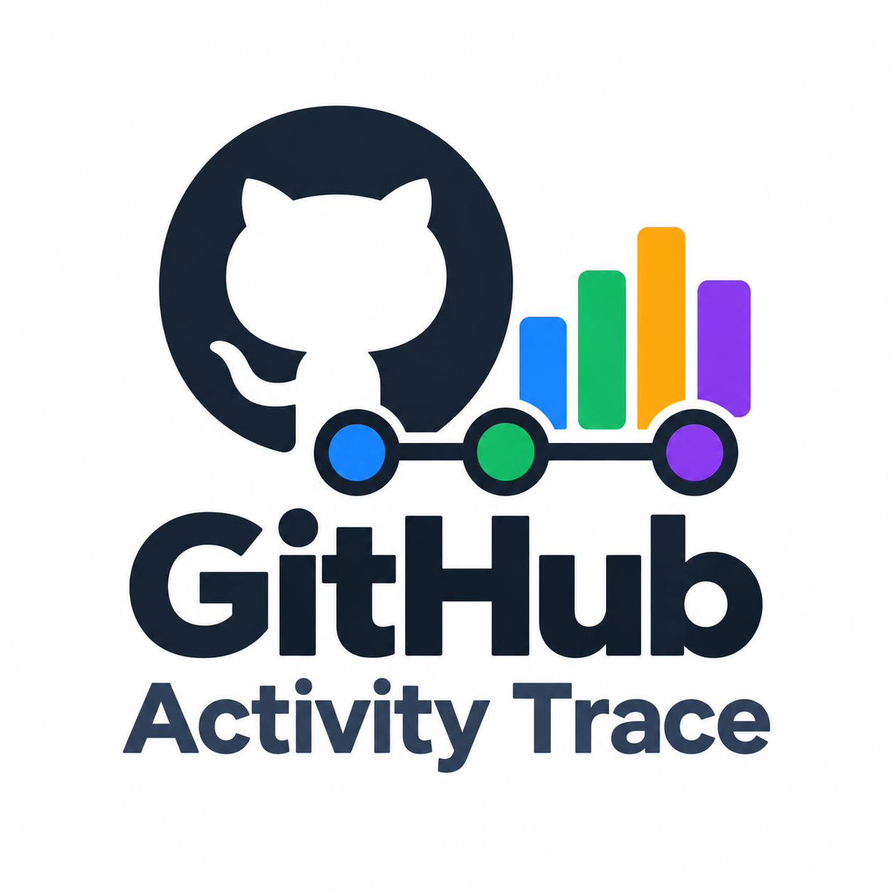

# GitHub Activity Trace

Aplikasi desktop dan web pemantau serta perangkum riwayat komit GitHub pribadi dan organisasi untuk kebutuhan pelaporan kerja berkala.



## Fitur Utama

- **Aplikasi Desktop Mandiri (Electron)**: Tersedia untuk Windows (Installer & Portable) dan Linux (Archive & Unpacked).
- **Pengaturan Langsung dari Aplikasi**: Masukkan dan ubah GitHub Token dan konfigurasi OpenAI langsung melalui modal **Settings** (ikon ⚙️) tanpa perlu mengedit file `.env.local` secara manual. Dilengkapi tombol **Test Connection**.
- **Filter Penulis Otomatis**: Hanya menampilkan repositori dan komit yang dibuat oleh akun pengguna terautentikasi (mengabaikan komit anggota tim lain di organisasi).
- **Filter Pemilik Repositori**: Filter cepat berdasarkan akun pribadi atau organisasi tempat berkontribusi.
- **Rentang Tanggal**: Memfilter aktivitas komit berdasarkan periode tanggal mulai dan selesai.
- **Paginasi Tabel**: Navigasi data responsif setinggi viewport (`100vh`) dengan header tabel tetap (*sticky*).
- **Terjemahan Bahasa Indonesia**: Toggle langsung di tabel untuk menerjemahkan pesan komit ke Bahasa Indonesia.
- **Salin Teks Praktis**: Tombol salin per baris saat *hover* dan tombol "Salin Semua" untuk seluruh halaman.
- **Ekspor Excel & Rangkuman AI**:
  - Mengelompokkan komit per tanggal dan repositori.
  - Merangkum daftar komit harian menjadi deskripsi tugas terpadu dalam Bahasa Indonesia menggunakan API kompatibel OpenAI.
  - Mengunduh file Excel (`.xls` SpreadsheetML) dengan format kolom: `Tanggal` (`DD-MM-YYYY`), `Repo`, `Task`.

## Kebutuhan Sistem

- Node.js 18.17+ / 20+
- GitHub Personal Access Token (PAT) dengan scope: `repo`, `user:email`, `read:user`
- (Opsional) Kredensial API OpenAI-compatible untuk fitur rangkuman AI

## Konfigurasi Pengaturan

Konfigurasi dapat diatur langsung di dalam aplikasi melalui tombol **Settings (⚙️)** di header kanan atas:

- **GitHub Personal Access Token**: Token akun GitHub Anda.
- **OpenAI API Key** *(Opsional)*: API Key untuk fitur rangkuman tugas otomatis.
- **OpenAI Base URL** *(Opsional)*: Base URL (default: `https://api.openai.com/v1`).
- **OpenAI Model** *(Opsional)*: Model AI (default: `gpt-4o-mini`).

*(Catatan: Aplikasi tetap mendukung konfigurasi melalui file `.env.local` sebagai fallback otomatis).*

## Mode Pengembangan

### 1. Menjalankan Desktop App (Electron Dev):
```bash
npm run electron:dev
```
Menjalankan Next.js server lokal pada port `3002` dan membuka jendela Electron dengan hot-reload aktif.

### 2. Menjalankan Web App (Browser):
```bash
npm run dev
```
Buka browser di `http://localhost:3002`.

### 3. Menjalankan Pengujian (Unit Tests):
```bash
npm test
```

## Build & Distribusi Aplikasi Desktop

Seluruh hasil build desktop akan tersimpan di direktori `dist-desktop/`.

### 1. Build untuk Windows:
```bash
# Menghasilkan installer (.exe) dan folder portable:
npm run build:electron
```
Hasil:
- **Installer Windows**: `dist-desktop/GitHub Activity Trace Setup 1.0.0.exe`
- **Portable / Unpacked**: `dist-desktop/win-unpacked/GitHub Activity Trace.exe`

### 2. Build untuk Linux:
```bash
# Menghasilkan archive portable (.tar.gz dan .zip):
npm run build:electron:linux

# Menghasilkan folder unpacked (binary native Linux):
npm run build:electron:linux:dir

# Menghasilkan paket Debian (.deb) & AppImage (di Linux/WSL/Docker):
npm run build:electron:linux:pkg
```
Hasil:
- **Archive Portable**: `dist-desktop/github-activity-trace-1.0.0.tar.gz` dan `github-activity-trace-1.0.0.zip`
- **Unpacked**: `dist-desktop/linux-unpacked/github-activity-trace`

## Menjalankan Build Web Produksi (Opsional)

Jika ingin menjalankan sebagai web server murni:
```bash
npm run build
npm run start
```

## Lisensi

MIT
